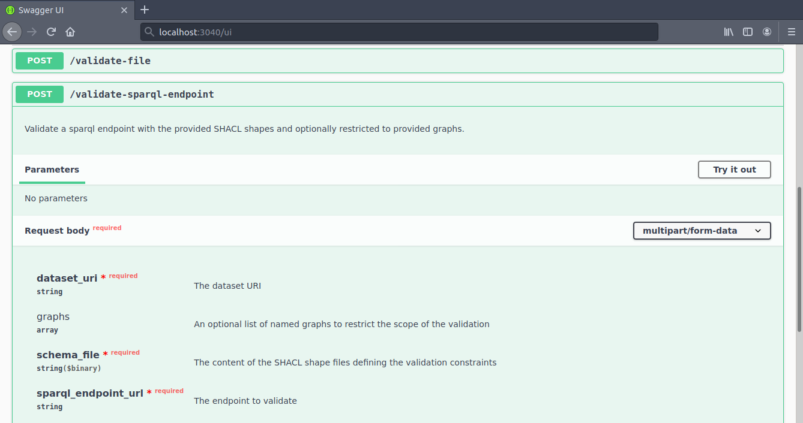
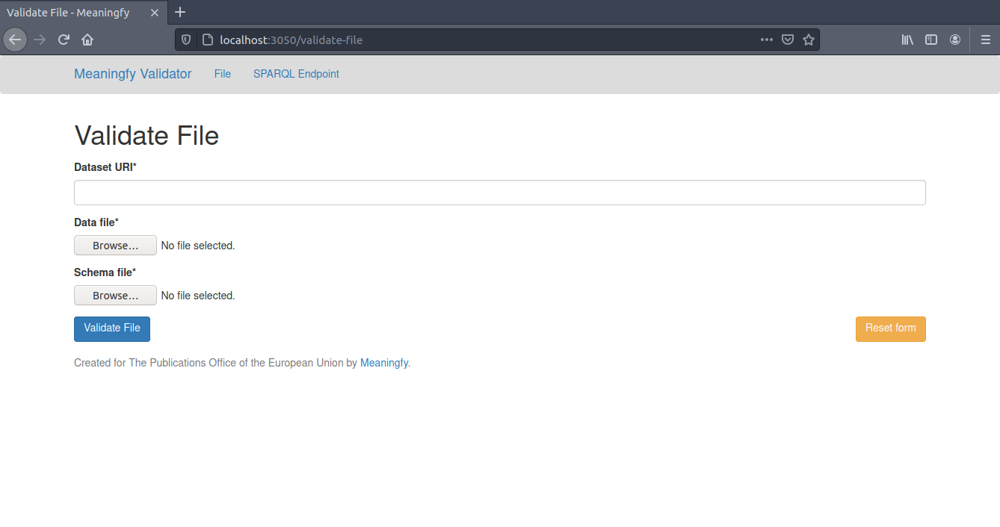
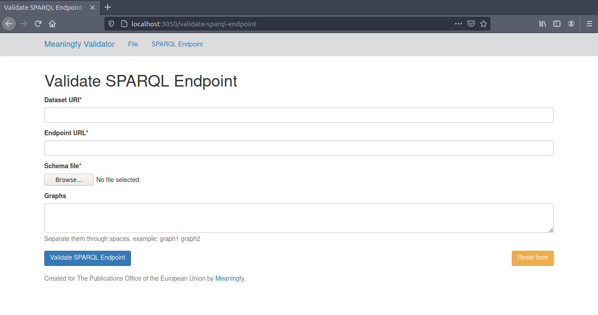
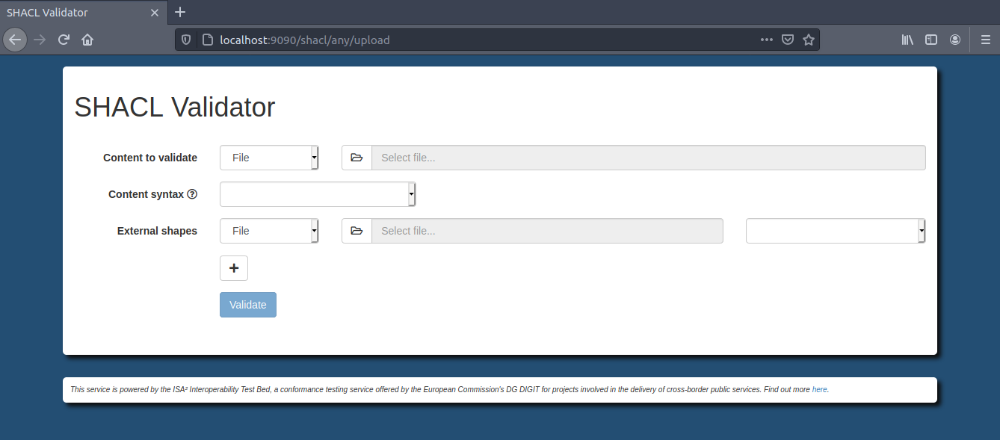
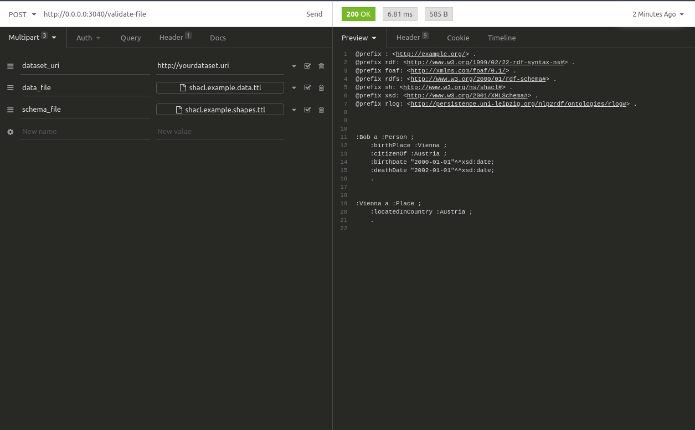
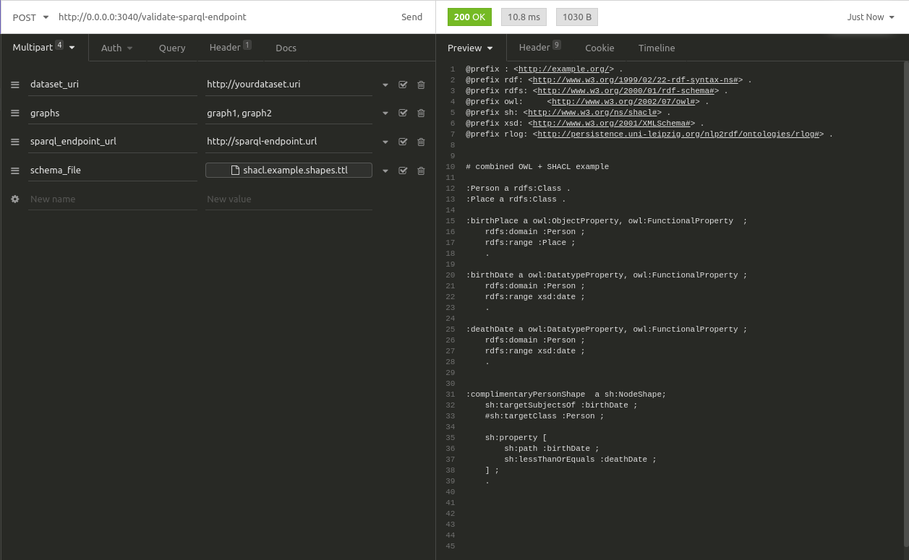

#  RDF validator

RDF validator is a web service for validating RDF data with SHACL shape definitions. It is based on the [RDFUnit](https://github.com/AKSW/RDFUnit) developed at the University of Leipzig. 

## Description

The validator services are split into:

service | URL | info
------- | ------- | ----
`validator-api` | [localhost:4010](http://localhost:4010) | _access [localhost:4010/ui](http://localhost:4010/ui) for the swagger interface_ 
`validator-ui` | [localhost:8010](http://localhost:8010)
`generic-validator`| [localhost:9090](http://http://localhost:9090/) | [Interoperability Test Bed](https://www.itb.ec.europa.eu/docs/guides/latest/)

### Validator API
>Go to this link [localhost:4010/ui](http://localhost:4010/ui) to access the online definition of the API.



### Validator UI
> File Validation page
>


> SPARQL Validation page



### Interoperability Test Bed
>Go to this link [http://localhost:9090/shacl/any/upload](http://http://localhost:9090/shacl/any/upload) to access the online definition of the API.<br>
>Access the API by accessing this link [http://localhost:9090/shacl/any/api](http://localhost:9090/shacl/any/api).



Read more documentation on configuring this RDF validator on [itb.ec.europa.eu](https://www.itb.ec.europa.eu/docs/guides/latest/validatingRDF/index.html).

## [Use-Cases Covered](usecase_description.md)

## Installation
Make sure that you are running `Docker` and have the correct permissions set.

```bash
sudo apt -y install docker.io docker-compose

sudo groupadd docker
sudo usermod -aG docker $USER
newgrp docker
```
---
### build and run the containers
To create the containers:
```bash
make build-dev
```

To run the docker containers:
```bash
make start-dev
```

To stop the docker containers:
```bash
make stop-dev
```

### run the tests
Install test/dev dependencies:
```bash
make install-dev
```

To run the tests:
```bash
make test
```

## Usage
### `validator-api` examples
> Validate File: [http://0.0.0.0:4010/validate-file](http://0.0.0.0:4010/validate-file)



> Validate SPARQL Endpoint: [http://0.0.0.0:4010/validate-sparql-endpoint](http://0.0.0.0:4010/validate-sparql-endpoint)



## Authors and acknowledgement
Written by: [Meaningfy](https://github.com/meaningfy-ws)

Validator tools used:
- [AKSW Research Group](https://github.com/AKSW/RDFUnit) at the University of Leipzig. 
