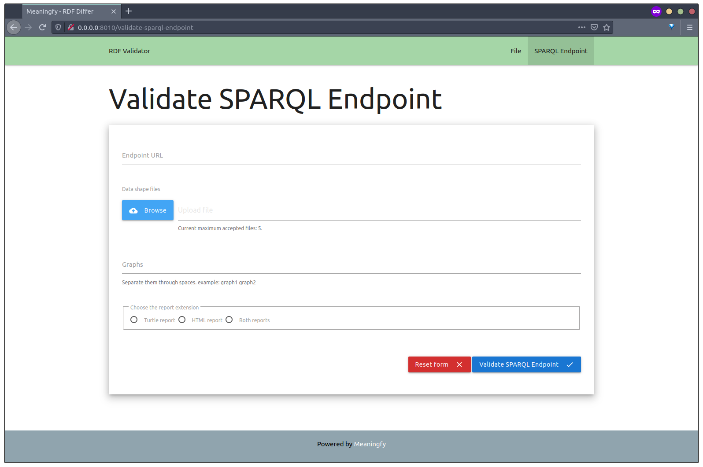

#  RDF validator

RDF validator is an online platform for validating RDF data with SHACL shape definitions. It is based on the [RDFUnit](https://github.com/AKSW/RDFUnit) developed at the University of Leipzig. 


The validator services are split into:

service | URL | info
------- | ------- | ----
`validator-api` | [localhost:4010](http://localhost:4010) | _access [localhost:4010/ui](http://localhost:4010/ui) for the swagger interface_ 
`validator-ui` | [localhost:8010](http://localhost:8010)

### Validator API
>Go to this link [localhost:4010/ui](http://localhost:4010/ui) to access the online definition of the API.


### Validator UI
> File Validation page
>


> SPARQL Validation page




## Installation
Make sure that you are running `Docker` and have the correct permissions set.

```bash
sudo apt -y install docker.io docker-compose

sudo groupadd docker
sudo usermod -aG docker $USER
newgrp docker
```
---
### build and run the containers
To create both the API and the UI containers:
```bash
make dev
```

To run the docker containers:
```bash
make start-dev
```

To stop the docker containers:
```bash
make stop-dev
```

### run the tests
Install test/dev dependencies:
```bash
make install-dev
```

To run the tests:
```bash
make test
```

## Usage
### `validator-api` examples
> Validate File: [http://0.0.0.0:4010/validate-file](http://0.0.0.0:4010/validate-file)


> Validate SPARQL Endpoint: [http://0.0.0.0:4010/validate-sparql-endpoint](http://0.0.0.0:4010/validate-sparql-endpoint)


## Contributing
You are more than welcome to help expand and mature this project. We adhere to [Apache code of conduct](https://www.apache.org/foundation/policies/conduct), please follow it in all your interactions on the project.   
When contributing to this repository, please first discuss the change you wish to make via issue, email, or any other method with the maintainers of this repository before making a change.

## Licence 
This project is licensed under [GNU GPLv3](https://www.gnu.org/licenses/gpl-3.0.en.html) licence. 
Powered by [Meaningfy](https://github.com/meaningfy-ws).